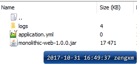

## Improved deployment

I want to be more flexible in deploying application.

### application directory

Usually, I put application files (like jar , logs, upload files etc.) on one directory, just like this:

```
/you_path/{appName}
| - attachments
| - app.jar
| - application.yml
| - lib
| - logs
```

* **attachments** store any thing created during application run , for example: uploaded file, user avatar image...
* **logs**	logs directory
* **app.jar**	package with spring maven plugin
* **application.yml** properties on production
* **lib**	[OPTIONAL] If you do not want a flat JAR, you can put 3rd party Jars into `lib` and use `-Dloader.path=lib` when start up

## Dockerfile

```shell
FROM openjdk:8-jdk-alpine

# We added a VOLUME pointing to "/tmp" because that is where a Spring Boot application 
#	creates working directories for Tomcat by default. 
# The effect is to create a temporary file on your host under "/var/lib/docker" 
#	and link it to the container under "/tmp"
VOLUME /tmp

# set default work directory, e.g.: -v /you/path:/mnt
WORKDIR /mnt

# e.g.: -e "JAVA_OPTS=-Xms2g -Xmx2g -Xmn1g"
ENV JAVA_OPTS=""

# arguments for running jar, e.g.: java -jar app.jar --spring.application.name=TEST
ENV ARGS=""

# default app name is app.jar , you should custom name specially
# Note it without .jar ext.
ENV JAR="app"

ENTRYPOINT exec java $JAVA_OPTS -Djava.security.egd=file:/dev/./urandom -jar ./$JAR.jar $ARGS
```

## run

build image
```
docker image build -t nerve/spring .
```

run container
```
docker run -d -v /mnt/docker/spring/monolithic:/mnt -e JAR=monolithic-web-1.0.0 --name m2 nerve/spring
```

At this section, application directory is `/mnt/docker/spring/monolithic`



try to set properties while create container
```
docker run -d -v /mnt/docker/spring/monolithic:/mnt -e JAR=monolithic-web-1.0.0 --name m3 -e ARGS="--spring.application.name=HELLO_MONOLITHIC" nerve/spring

# check output : OK
root@a8832d857bd6:/mnt/docker/spring# curl 172.17.0.4:8080/whatTimeIs && echo
[HELLO_MONOLITHIC] 2017-10-31 08:53:37
```

When you need to update new version application, just replate `app.jar` and restart container then enjoy!

## appendix : run with mini-jar

Sometime we want a mini-jar (without 3rd-party jars which may not modified for a long time)

configuration `spring boot maven plugin` on `pom.xml`

```xml
<plugin>
    <groupId>org.springframework.boot</groupId>
    <artifactId>spring-boot-maven-plugin</artifactId>

    <configuration>
        <layout>ZIP</layout>
        <!--
            使用 includes 方式来控制打包后的 jar 中包含哪些库
            只需要包括 com.zeus 的模块

            对于第一次打包，请先完整打包（注释掉 includes 即可），然后导出其中的全部第三方库（比如保存到 libs）
            以后迭代升级时，则开启  includes ，只更新开发模块
        -->
        <includes>
            <include>
                <groupId>nothing</groupId>
                <artifactId>nothing</artifactId>
            </include>
        </includes>
    </configuration>
    <executions>
        <execution>
            <goals>
                <goal>repackage</goal>
            </goals>
        </execution>
    </executions>
</plugin>
```

then create new container
```
docker run -d -v /mnt/docker/spring/monolithic:/mnt -e JAVA_OPTS="-Dloader.path=lib" -e JAR=monolithic-web-1.0.0 --name m3  nerve/spring
```